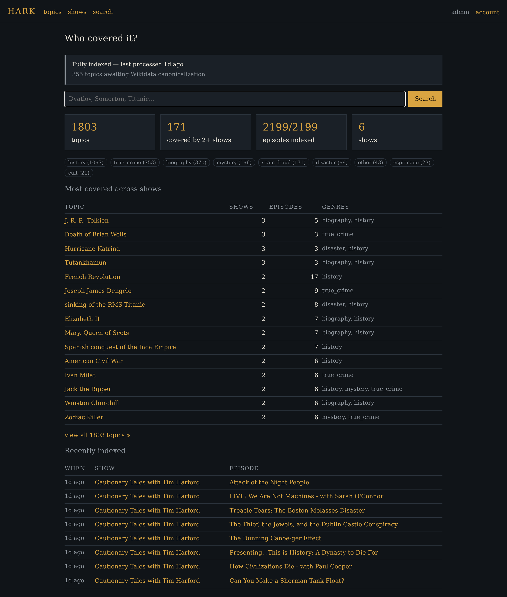
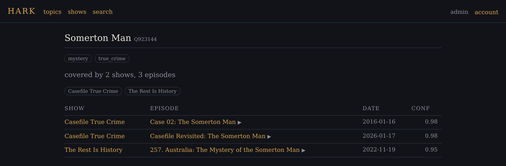
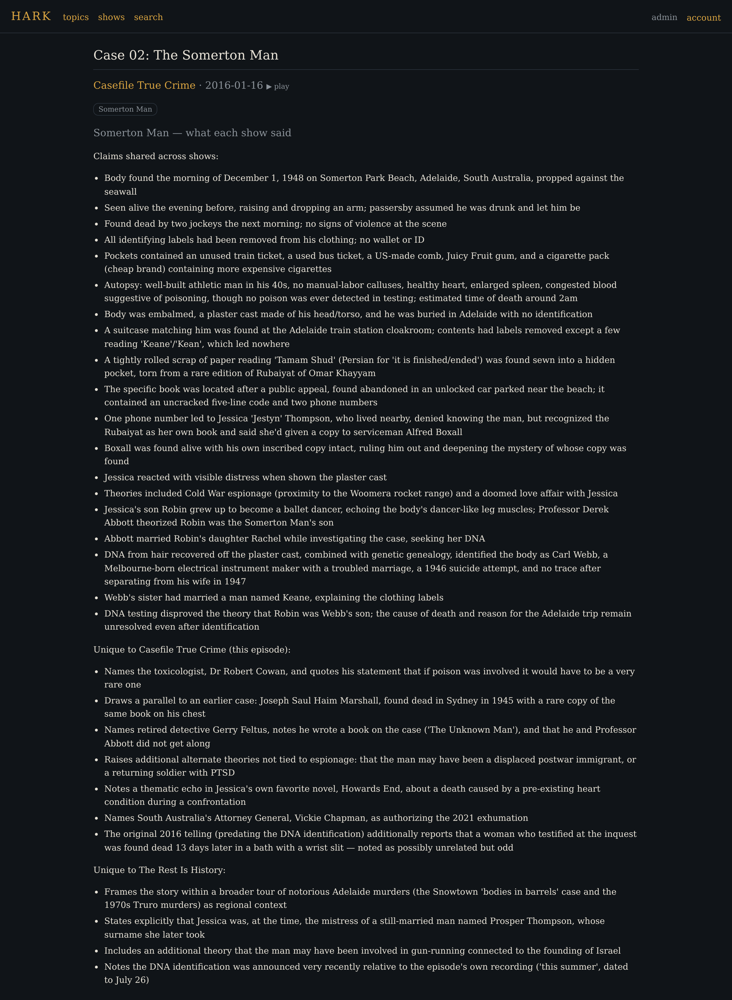
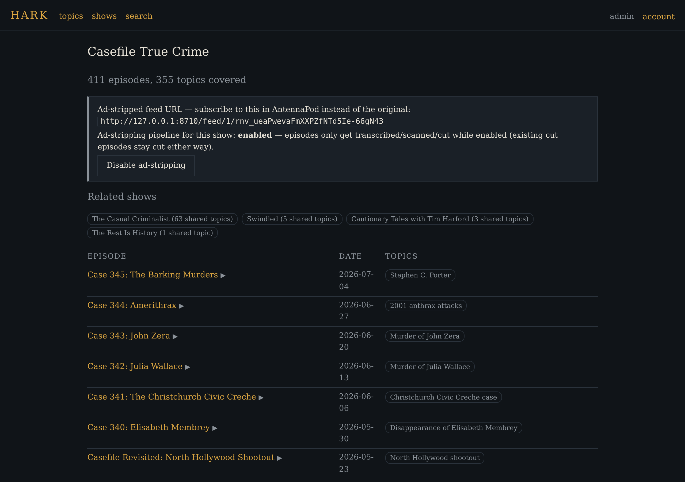

# hark

Cross-podcast topic index and discovery service for subject-per-episode genres
(true crime, history, disasters, and the like). The goal: resolve episodes to the
real-world case/event/person they cover, so you can ask "who covered the Dyatlov
Pass incident?" and compare treatments across shows.

hark also strips ads from every subscription (not just the genre-curated shows
above) by depending on [adscrub](https://git.onetick.ninja/flan/adscrub) — a
separate, standalone product — as a library: `hark chapters`/`transcribe`/
`detect-ads`/`cut` call straight into adscrub's functions, since hark's own
`episodes`/`ad_segments` schema was deliberately shaped to match adscrub's, so
adscrub's schema-coupled functions work unchanged against hark's database.
Nothing here is a copy of adscrub's code — see CLAUDE.md and docs/PLAN.md for
the integration design and why it's a dependency, not a merge. Ad-stripping is
per-show (on by default) — toggle it from that show's page, which also shows
the feed URL to subscribe to in AntennaPod once you're ready.

Once a topic has transcripts from 2+ shows (from the ad-stripping pipeline's
transcription step), hark can also compare what each show actually claimed —
shared facts vs. claims unique to one show's telling — shown on every
episode's own page.

The deployed instance runs its own pipeline unattended: subscription sync, ingest,
canonicalization, chapter-scanning, transcription, and ad-cutting all run on a
schedule with no manual steps. Topic extraction and claims comparison — the two
steps that need real judgment, not just fetching/matching — run the same way but as
a scheduled Claude agent instead of a paid API call (`claude-fleet`'s
`jobs/agents/hark-pipeline.md`); this project has never used `$ANTHROPIC_API_KEY`
and isn't starting now. See docs/PLAN.md's "Deployed pipeline automation" section.

See `docs/PLAN.md` for milestones. Current state (0.11.0): feed resolution,
episode ingest, LLM topic extraction with Wikidata canonicalization, the
cross-show topic index, a full web UI, adscrub-backed ad-stripping (with a
per-show on/off toggle and feed URL, both from the show page), cross-show
claims comparison, M2 discovery (related shows/topics by co-occurrence,
candidate-show search, and an interim notable-episodes page), M3's
AntennaPod loop (Nextcloud gpodder subscription + listen-history sync, OPML
import fallback), and a per-show topic-index toggle (new shows start
excluded from extraction until reviewed — most subscriptions aren't
subject-per-episode genre shows) — deployed live.

## Demo

The dashboard: coverage stats, genre breakdown, and the most-covered topics
across shows.



A topic page — every episode across every show that covers it:



The actual point of this project: once 2+ shows have transcripts for the same
topic, hark diffs what they each said — shared facts vs. claims unique to one
show's telling — right on the episode page.



A show page: ad-stripped feed URL to subscribe to in AntennaPod, the per-show
on/off toggle, and related shows by topic overlap.



## Usage

```
uv sync
uv run hark resolve            # feeds.txt show names -> feed URLs (iTunes Search API)
uv run hark ingest             # fetch feeds, upsert episodes (idempotent)
uv run hark extract --limit 20 # extract episode subjects (needs $ANTHROPIC_API_KEY)
uv run hark load batch.jsonl   # ingest pre-computed extractions (batch runs, no API key needed)
uv run hark canon              # retry Wikidata canonicalization for unmatched topics
uv run hark stats              # counts per show
uv run hark topics             # topics ranked by cross-show coverage
uv run hark who "dyatlov"      # who covered X (label substring or Wikidata QID)

# M3: subscriptions/history from Nextcloud's GPodder Sync app, or an OPML export
uv run hark sync-subscriptions --nextcloud-url https://host:9001 \
  --nextcloud-user U --nextcloud-password P   # register new shows from subscriptions
uv run hark sync-history --nextcloud-url ...  # play-history events, for future M4 scoring
uv run hark import-opml export.opml           # same show-registration, from a file instead

# M2: candidate shows not yet tracked (report-only unless --add)
uv run hark discover --genre true_crime --add

# ad-stripping pipeline (backed by the adscrub library) — every show, not just feeds.txt's
uv run hark chapters           # scan chapter markers for ad spans (free — no transcription)
uv run hark transcribe         # Whisper the rest
uv run hark transcribe --cross-show-only  # priority subset: episodes on topics 2+ shows cover
uv run hark detect-ads         # LLM ad-span classification (needs $ANTHROPIC_API_KEY)
uv run hark cut                # ffmpeg out the ad spans
uv run hark fsck --fix         # clear transcript_path pointers whose file no longer exists

# cross-show claims comparison — once a topic has 2+ shows' transcripts
uv run hark compare                    # live, needs $ANTHROPIC_API_KEY
uv run hark load-comparisons out.jsonl # pre-computed (batch runs, no API key needed)
```

The database defaults to `./hark.db`; override with `--db` or `$HARK_DB`.
Show names live in `feeds.txt`, one per line, `#` for comments.

## Setup

adscrub is a **path dependency** (`../adscrub`, editable — see
`pyproject.toml`'s `[tool.uv.sources]`), so `flan/adscrub` needs to be checked
out as a sibling of this repo before `uv sync` will resolve it:

```
cd .. && git clone ssh://git@git.onetick.ninja:55214/flan/adscrub.git
cd hark && uv sync
```

This works for local development; it does **not** yet work for the Docker
build (the build context only has hark's own files) — see the Dockerfile's
"KNOWN GAP" comment and docs/PLAN.md's open questions. Not solved yet.

## Web UI

`hark web` serves the topic index (default `0.0.0.0:8710`): a home dashboard
(coverage stats, genre breakdown, live indexing status, ad-stripping/claims-
comparison pipeline status, recently-indexed feed), topic pages ("who
covered X"), per-show pages (episode list, ad-stripping toggle + feed URL,
topic-index toggle, per-show pipeline progress, related shows), a `/shows`
list flagging any not yet reviewed for the topic index, genre-filtered and
paginated topic browsing, an interim `/notable` page (most-contested claims
comparisons, rarest-genre episodes), and search. The whole site is behind a
session login wall; only `/login`, `/logout` and `/healthz` are open.
Bootstrap: set `HARK_ADMIN_TOKEN`, sign in as `admin` with that token, then set
a real password at `/account` (the token stops working once a password exists;
with neither set, login is impossible — fail-closed). Sessions live in a
separate `auth.db` (`--auth-db` / `$HARK_AUTH_DB`) so replacing `hark.db` with
a fresh data snapshot never logs anyone out. Set `HARK_COOKIE_SECURE=1` when
serving behind a TLS-terminating proxy.

The same server also answers `GET /feed/<show_id>/<token>` (the cleaned RSS
feed) and `GET /audio/<episode_id>/<token>.<ext>` (locally-cut episodes) —
deliberately *not* behind the login wall, since a podcast app can't do cookie
login. Instead each show gets a random `feed_token` (auto-generated,
`shows.feed_token`) that has to appear in the URL; wrong or missing token is a
404, not a redirect to `/login`. `--base-url`/`$HARK_BASE_URL` must be set to
wherever the podcast player can actually reach this server — it's embedded in
every generated audio link, and `web` warns if left at the unreachable
`localhost` default.

In Docker: `docker compose up -d` (mounts `./data`, serves :8710); pipeline
stages run as one-shots, e.g. `docker compose run --rm hark ingest`.
Transcription runs CPU-only by default — see `compose.gpu.yaml` and CLAUDE.md
for the GPU deploy path. Set `HARK_NEXTCLOUD_URL`/`_USER`/`_PASSWORD` (and
`HARK_NEXTCLOUD_INSECURE=1` for a self-signed cert — see `--nextcloud-insecure`
above) to enable `sync-subscriptions`/`sync-history` in a scheduled pipeline
run; without them M3 sync is simply skipped, same fail-soft shape as
`$ANTHROPIC_API_KEY` being unset for `extract`/`compare`.

Extraction calls the Anthropic API (default model `claude-opus-4-8`; override
with `--model` or `$HARK_MODEL`) and canonicalizes labels against Wikidata so
aliases merge ("BTK" = "Dennis Rader"). Runs are idempotent and resumable:
processed episodes are marked and skipped, failures are retried next run.
Ad-span classification is a separate model default (`--model`/`$HARK_AD_MODEL`)
since it's a differently-shaped task.

## Development

```
uv run pytest
```

Tests use local feed fixtures — no network.

## AI use disclosure

This project is developed with substantial assistance from AI coding tools
(Anthropic Claude). Design decisions and review are human; much of the code is
AI-written.
